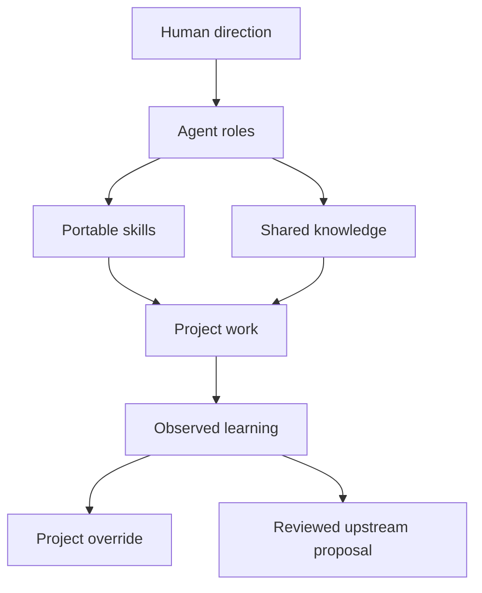

# Architecture

## Thesis

Many Hats separates four concerns that tend to become tangled in agent repositories:

1. **People** — stable roles, boundaries, and collaboration expectations.
2. **Practice** — portable skills with testable behavioral contracts.
3. **Knowledge** — project facts and reusable domain intelligence.
4. **Work** — project-local artifacts, decisions, and adaptations.

Agents are not folders of private knowledge. Skills are not personalities. Project facts are not universal instructions.

## System model

## Object Library decision

The Object Library lives under `knowledge/objects/` beside other organizational intelligence. It is not embedded in Luke's agent folder and is not classified as analytics.

This placement reflects the object model's actual role: it is shared semantic infrastructure. Charlie uses it for page architecture, Echo for labels, Finn and Relay for entities and contracts, Cipher for data sensitivity, and Ledger for measurement grain. Luke is the steward responsible for structural integrity, naming, relationships, states, and lineage.

### Object lifecycle

1. **Reference** — a project links to a shared object without editing it.
2. **Fork** — a project needing a different definition creates a project-local object with `derived_from` metadata.
3. **Promote** — a demonstrated improvement is reviewed and deliberately reconciled into the shared library.

Never edit a shared object in place to satisfy an unreviewed project assumption. Generated graphs and databases may index the library, but plain Markdown plus YAML frontmatter remains canonical.

## Knowledge plane

| Collection | Canonical contents | Steward | Typical consumers |
| --- | --- | --- | --- |
| `objects/` | Objects, attributes, relationships, actions, states | Luke | All agents |
| `evidence/` | Sources, observations, confidence, provenance | Scout | Liza, Charlie, Allie, Ledger |
| `decisions/` | Options, rationale, consequences, reversibility | Liza | All agents |
| `metrics/` | Metric definitions, events, experiments, grain, ownership | Ledger | Liza, Finn, Relay, Harbor |
| `glossary/` | Domain term, UI label, code identifier, exclusions | Echo | Luke, Charlie, Finn, Relay |

Engagement-specific briefs (direction, flows, challenge memos, threat models, run packets, and similar) live under `projects/<project>/work/` using templates in `templates/work/`. See [`docs/artifacts.md`](docs/artifacts.md).

Cross-links use stable IDs. A generated `knowledge/graph.json` may support queries but is rebuildable and never authoritative.

## Skill ownership

Each skill has one accountable primary agent and may name collaborators. Ownership means maintaining the contract and evaluating changes; it does not prohibit other agents from loading the skill.

Design Dash's stage-oriented micro-skills are consolidated into role-oriented skills. The mapping is recorded in `docs/design-dash-migration.md`. Consolidation removes repeated instructions while preserving distinct gates, outputs, and specialized references.

## Local versus shared learning

Learning follows the narrowest-valid-scope rule:

| Evidence | Destination |
| --- | --- |
| One user's preference or one product's terminology | `projects/<project>/overrides/` |
| A domain fact or object discovered for one project | `projects/<project>/knowledge/` |
| A reusable improvement with evidence across contexts | Core skill or agent PR |
| A host-specific workaround | Relevant adapter |

Core promotion requires a motivating case, before/after behavior, regression evaluation, compatibility note, and human-approved PR. Agents do not learn by accumulating every correction as a universal rule.

## Distribution

Portable `SKILL.md` packages are canonical. Adapters may expose them to Claude Code, Codex, Cursor, GitHub Copilot, Windsurf, or another host without changing the portable instructions. The installer prefers a shared `.agents/skills/` symlink mount (plus `.claude/skills/` for Claude Code) and generates named-agent wrappers only where the host has a native agent primitive. See `docs/host-adapters.md`.
