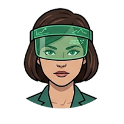

# Agent roster and routing

Agent files define stable responsibility boundaries and collaboration behavior. Skills remain separate and load only when a task activates them. Each specialist has a hat icon in [`avatars/`](../avatars/).

| | Agent | Title | Primary skills | Bring in when |
| --- | --- | --- | --- | --- |
|  | Liza | Product Lead | `lead-product-direction`, `run-product-team` | Direction, priority, scope, requirements, tradeoffs |
|  | Luke | Domain & Systems Architect | `model-product-domain` | Objects, states, rules, permissions, domain consistency |
|  | Charlie | Product Designer | `map-product-flows` | Journeys, IA, flows, wireframes, usability |
|  | Iris | UI & Design Systems Designer | `shape-interface-system` | Components, visual hierarchy, interaction patterns, tokens |
|  | Finn | Full-Stack Engineer | `implement-product-slice` | Production implementation and technical decomposition |
|  | Sentry | Quality & Adversarial Reviewer | `verify-product-quality` | Failure modes, test strategy, regressions, release readiness |
|  | Scout | Research & Insights Analyst | `research-product-evidence` | Research questions, evidence collection, synthesis, confidence |
|  | Cipher | Security & Privacy Engineer | `review-security-privacy` | Threats, trust boundaries, sensitive data, privacy controls |
|  | Ledger | Data & Analytics Architect | `design-product-measurement` | Metrics, events, experiments, reporting grain |
|  | Echo | Content Designer | `design-product-language` | UI terminology, labels, instructions, voice, comprehension |
|  | Relay | Platform & Integrations Engineer | `design-product-integrations` | APIs, contracts, external systems, degraded behavior |
|  | Harbor | DevOps & Reliability Engineer | `prepare-product-operations` | CI/CD, observability, SLOs, rollback, incidents |
|  | Allie | Product Critic | `critique-product-decision` | Independent challenge before commitment or release |

All agents may use `evolve-team-practice` when demonstrated learning warrants a local override or an upstream proposal.
